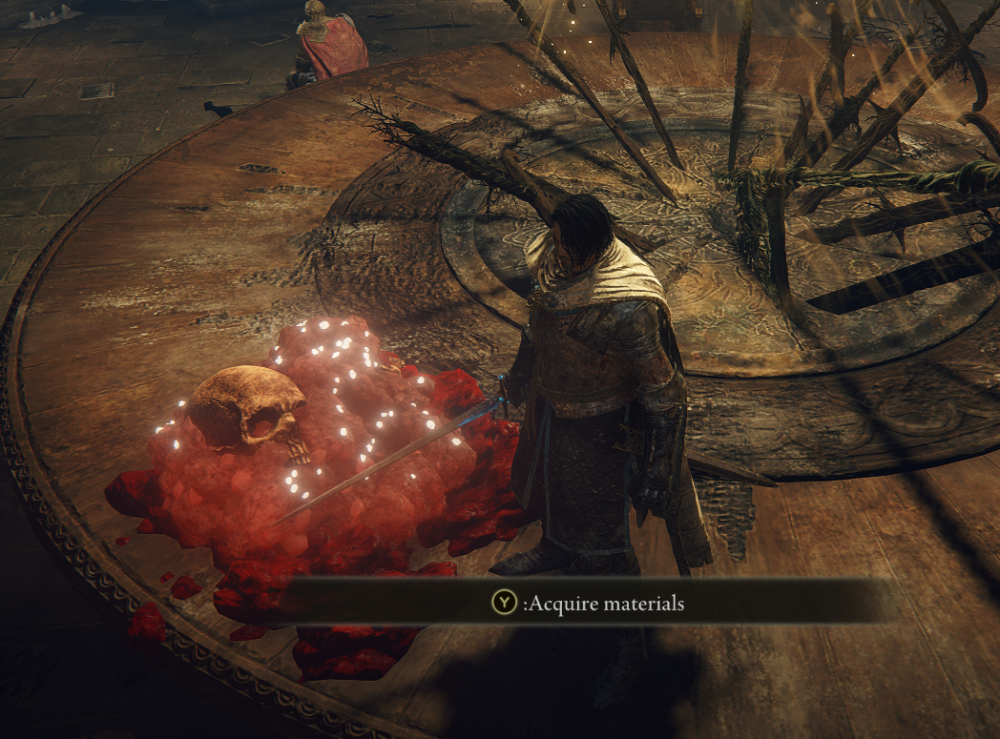

# Elden Ring examples

## Debug line
Draws a CSEzDraw debug line from the players position to 1m in front of the player in the direction they're facing.

[Code](debug-line/src/lib.rs).

Preview image

## Apply speffect
Applies and removes an speffect based on keypresses (O to apply and P to remove).

[Code](apply-speffect/src/lib.rs).

Preview image

## Spawn asset (AEG)
Spawns bloodied poop at twice the scale at the players location whenever H is pressed.

[Code](spawn-asset/src/lib.rs).

Preview image

