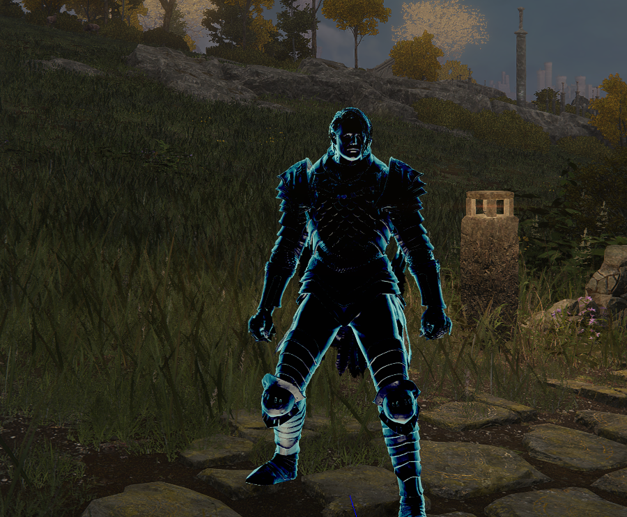

# Elden Ring examples

## Debug line
Draws a CSEzDraw debug line from the players position to 1m in front of the player in the direction they're facing.

Result:

## Apply speffect
Applies and removes an speffect based on keypresses (O to apply and P to remove).

Result:

